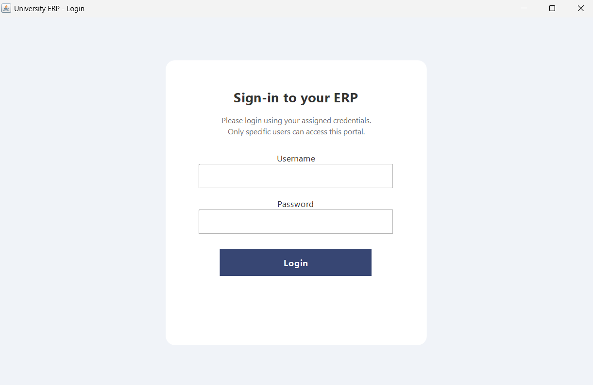
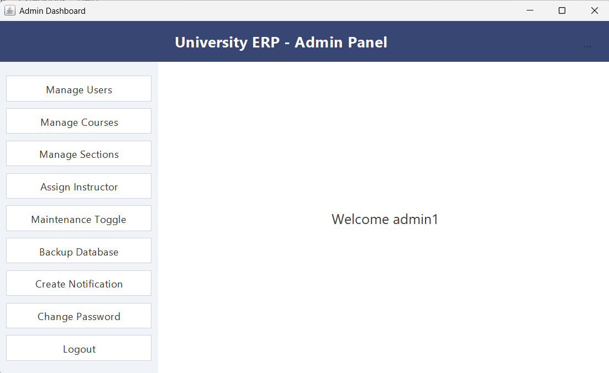
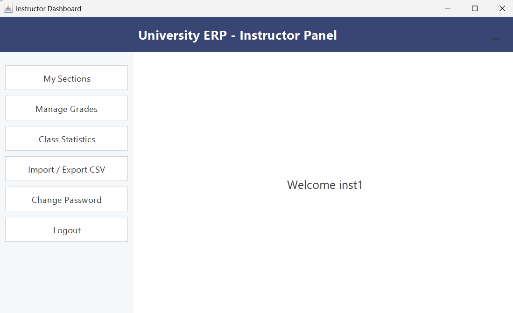
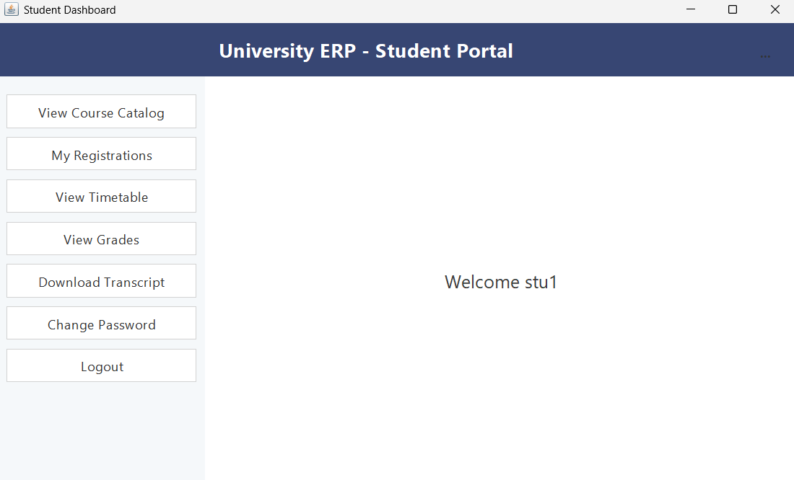
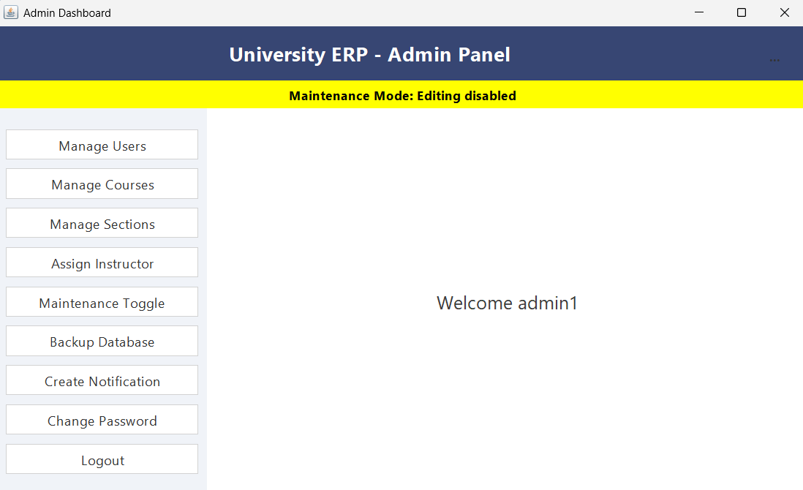

# University ERP System

## Introduction
The system supports three primary user roles — **Administrator, Instructor, and Student** —
each with distinct permissions and functionalities.

### Modules Included
- User Authentication
- Course Management
- Assignment & Grade Management
- Maintenance Requests
- Notification System (Admin → Instructor / Student)
- Dual Database Architecture (Login DB & ERP DB)

---

## Screenshots






---

## Role-Based Access Control

### Admin
- Create / view / edit / delete users (Instructor / Student)
- Create / view / edit / delete courses
- Assign instructors to courses
- View and manage all maintenance requests
- Create notifications (broadcast or targeted)
- **Cannot** enter marks or view grades

### Instructor
- View assigned courses
- Upload assignments, marks, and grades
- View notifications sent by admin
- View maintenance announcements
- **Cannot** manage users
- **Cannot** create notifications

### Student
- View enrolled courses
- View grades
- Download assignments
- Submit maintenance requests
- View notifications
- **Cannot** modify marks
- **Cannot** create notifications

---

## How to Run

1. Clone the repository
   ```bash
   git clone https://github.com/24akshainie/erp.git
